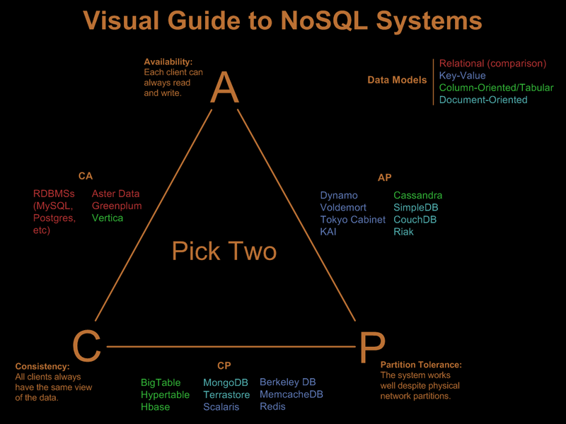

# Contenido capacitación

Se explicaron los temas como abajo de detallan. También hubieron actividades
integradoras donde les plantié una problematica y trabajamos durante varias clases
con dichos problemas integrando distintos temas del curso:

# Actividades integradoras y temas que cubrieron

Mini explicación de cada actividad con una listado de temas cubiertos en la actividad
en orden de aplicación.

### Framework

Como en el nivel inicial vieron phalcon, slim y otros frameworks web la idea de esta
actividad fue que puedan hacer su propie framework bien rudimentario para que entiendan
cuales cosas hacen los frameworks, que no es muy difícil.
También use esta actividad para explicar como anda PHP, que es server-side y que tenemos
un http server para servir los PHP

- PHP funcionamiento
- MVC
  - Controladores
  - Responses
- Decorator (agregando filtros o validaciones a los controladores)
- Routers de URL => controlador

### UML

Para explicar sobre clases y las distintas actividades definimos que es UML. Explicacion
sobre composición de clases y agregación de clases. Tomando como base:

https://en.wikipedia.org/wiki/Object_composition

### Patrones de diseño

- MVC
  - Actividad: Framework
- Decorator
  - Actividad: Billetera
- Composite
  - Actividad: Caja
- Adapter

### Tateti

- TDD
  - PHPUnit

### Colas y Pilas

Cual es la idea de colas y pilas para luego integrarlos con Rabbitmq. Cual es el proposito de ellas y posibles usos en Threads, tareas a realizar en diferido, etc.

- Implementar una Cola
- Implementar una Pila
- Implementar una Cola usando solamentes Pilas.

### Chat

- Rabbitmq
  - Implementamos un chat con una cola por cada usuario y lo hicimos andar en vivo
- Python / Rabbitmq
- Threads

### Cadenas de Markov

Se implemento en clase unas cadenas de markov para fomentar el uso de Python, listas y conceptos varios. En particular dejamos andando una cadena de markov que genera frases como Borgues :)

### Ahorcado

- TDD
- PHPUnit tests
- Clases / objetos
- RabbitMQ

### Tateti

- TDD
- Patrones de diseño
- UML
- Clases / Objetos

# Temas Principales

## Primera Semana repaso temas curso anterior:

- Como funciona PHP
- Linux
- Ciclos
- Arrays
- Scope
- Objetos / Clases / Interfaces

## TDD

- https://en.wikipedia.org/wiki/Test-driven_development
- Hicimos dos actividades de programar con TDD
  - Tateti
    - La razón de esta actividad es programar los tests desde cero, ir agregando tests y las funcionalidades.
      Esto esta bueno porque todo el mundo conoce las reglas del tateti y la idea detras de la actividad es
      terminar teniendo el tateti 100% funcional sin haber probado ni una sola vez el juego nosotros mismos.
      Demostrar que si los tests cubren todos los casos, el programa queda 100% funcional sin siquiera testearlo nosotros mismos a mano
  - Ahorcado
    - Mismo que anterior, pero mucho más complejo

## JWT Tokens

No se vio de forma practica, simplemente se explico el tema tomando como base esto:
- https://jwt.io/introduction/

## Automatizacion/Build Jenkins

Se explico el contenido pero no se hizo ninguna actividad.

## NoSql

- Explicación de que son, porque queremos y algunos ejemplos.
- Comparación con sql:
  - No tiene estructura rigida
  - Se piensa que son documentos en lugar de registros
  - Hay colecciones de documentos

### Explicación:

We need understand what is your problem in the current application?

Transactions
Amount of data
Data structure
NoSQL solves the problems of scalability and availability against that of atomicity or consistency.

Basic drive us to CAP theorem. Eric Brewer also noted that Of the three properties of shared-data systems – Consistency, Availability and tolerance to network Partitions – only two can be achieved any given moment in time. (CAP theorem)

### NOSQL Approach

- Schemaless data representation:
  -Most of them offer schemaless data representation & allow storing semi-structured data.
  -Can continue to evolve over time— including adding new fields or even nesting the data, for example, in case of JSON representation.
- Development time:
  - No complex SQL queries.
  - No JOIN statements.
- Speed:
  -Very High speed delivery & Mostly in-built entity-level caching
- Plan ahead for scalability:
  -Avoiding rework

### NoSql MongoDB

Se explico la API de mongo DB. Levantamos una maquina de docker para tenerlo instalado más fácil.
Una actividad que se hizo fue la simulación de una base de datos donde se guarda de forma distribuidas usarios. Se explico el proceso de Sharding y el proceso de re-sharding cuando se agregan nuevos servidores.

### NoSql ElasticSearch

Se explico, mostro caracteristicas y ejemplos pero no se trabajo en clase con este motor.

## Queue Rabbit

Se hizo un canal de chat publico donde todos podian leer o escribir mensajes de forma anonima. Se hizo que el juego del ahorcado se pudiera jugar desde distintas maquinas por medio de las colas.

Conceptos que se explicaron:

- Concepto de cola
- Concepto de canal de mensajes
- Mensajes
    - Tiempo de vida de un mensaje
    - Cuando se consume un mensaje se puede marcar como no consumido o como consumido para que no vuelva a salir

## Arquitectura MVC, MVVM

Tomado como base de: https://en.wikipedia.org/wiki/Model%E2%80%93view%E2%80%93controller

La idea fue explicar que hace un framework e implementar uno propio simple.

## Stateless

- Problematica
- Solución
- Ventajas
  - Aplicación

## Escalabilidad / Alta disponibilidad

Escalabilidad es la capacidad de nuestro sistema en incrementar y decrementar su capacidad de
computo de forma discrecional y casi sin modificar código para lograrlo. Un ejemplo sería
tener base de datos y que se agreguen y se saquen replicas cuando son necesarias porque el
trafico es muy grande.

Alta disponibilidad se trata sobre estar el mayor tiempo posible operativo, intentar estar
100% del tiempo online y sin fallas.

Para cubrir ambos temas debemos tener en cuenta cuales son las caracteristicas de nuestro
sistema y entender cuales pueden ser los puntos de falla. Otros temas relacionados a este
es el de microservicios que es una buena forma de poder levantar más instancias de nuestro
sistema en caso de necesitarlo.

- DBMigration
  - sharding
  - resharding
- load balancer
- DBs
  - master / slave
  - replicas

## Microservicios

Microservicios es el metodos de desarrollar aplicaciones, que estan hechas independientemente
del resto del sistema y se puede hay un deploy individual. Cada microservicio corre un único
proceso y se comunica de forma simple, bien definida para el sistema como puede ser un
contenedor para brindar su servicio.

## Data Consistency / Distribution / Replication

- DBMigration
  - sharding
  - resharding
- DBs
  - master / slave
  - replicas

## PHP Avanzado Threading

- No se dio

## PHP Avanzado APCU

https://flaviocopes.com/php-caching/

## Workers

A diferencia de PHP que cada request ejecuta de inicio a fun un script PHP, otros
lenguajes tienen un solo script/programa que corre todo el tiempo y atiende todos
los requests que le llegan. Para que esto sea posible, entre otras cosas, se
necesita una forma de que varios requests corran al mismo tiempo y sin "pisarse"
la información con lo cual aparece el concepto de Threads.
Los threads son procesos que corren dentro de tu programa pudiendo compartir cierta
información entre los distintos procesos y el proceso prinpical desde donde fueron
todos creados. Cada lenguaje tiene su forma implementar esto pero en general la API
en los distintos lenguages es bastante similar.

Actividades:

- Chat
- Algoritmos sobre listas de tamaño muy grande
  - Por ej. contar todos los numeros de una lista de miles de posiciones
    donde tuvimos que crear varios threads para hacerlos y que cada
    thread contara desde posiciones iniciales diferentes y sin contar los
    mismos numeros varias veces.

### Python

- Chat
- Threads
- Contador de numeros
- Markov

### Java
### NodeJs

## Docker

Como actividad levantamos un contenedor con un rabbitmq para crear el Chat.
También levantamos un mongodb para la actividad de DBMigration.

https://blog.sourcerer.io/a-crash-course-on-docker-learn-to-swim-with-the-big-fish-6ff25e8958b0

## NoSql Cassandra

Se vio como trabajaba y las ideas compartidas junto a mongdb pero no se hizo ninguna actividad.

## Queue Kafka

No se dio

## Arquitectura Lambda

No se dio

## CQRS

https://docs.microsoft.com/en-us/azure/architecture/patterns/cqrs
https://hackernoon.com/1-year-of-event-sourcing-and-cqrs-fb9033ccd1c6

## Streams

No se dio